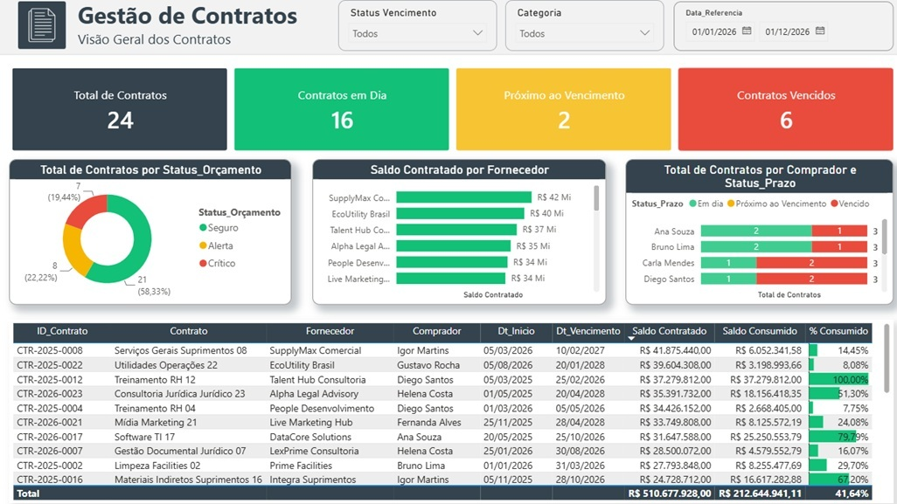

# 📊 Dashboard de Gestão de Contratos (Power BI)

> Projeto de portfólio — Dashboard interativo desenvolvido em Power BI para acompanhamento e gestão de contratos, com foco em análise de prazos, status orçamentário e desempenho financeiro.

## 🎓 Contexto

Este projeto foi desenvolvido durante um **curso de Power BI**, como forma de praticar e aplicar conceitos de modelagem de dados, DAX e design de dashboards em um caso de uso realista.

> ⚠️ **Os dados utilizados são fictícios**, criados apenas para fins didáticos e de demonstração. Não representam contratos, fornecedores ou valores reais.

## 🎯 Objetivo do projeto

Este projeto simula um cenário de gestão de contratos empresariais, com o objetivo de demonstrar habilidades em **modelagem de dados, DAX e design de dashboards no Power BI**, aplicadas a um caso de uso comum em áreas de compras, jurídico e financeiro.

## 📌 Sobre o dashboard

O relatório oferece uma visão centralizada sobre a carteira de contratos, permitindo filtrar por **Status Vencimento**, **Categoria** e **Data de Referência**.

### KPIs principais
- **Total de Contratos** — quantidade total de contratos cadastrados.
- **Contratos em Dia** — contratos dentro do prazo.
- **Próximo ao Vencimento** — contratos se aproximando da data limite.
- **Contratos Vencidos** — contratos já vencidos.

### Visualizações
- **Total de Contratos por Status_Orçamento** — gráfico de rosca (Seguro, Alerta, Crítico).
- **Saldo Contratado por Fornecedor** — ranking dos fornecedores por valor contratado.
- **Total de Contratos por Comprador e Status_Prazo** — comparação entre compradores, segmentado por status de prazo.
- **Tabela detalhada de contratos** — ID, fornecedor, comprador, datas, saldo contratado, saldo consumido e % consumido, com totais gerais.

## 🛠️ Skills demonstradas

- Modelagem de dados no Power BI
- Criação de medidas com **DAX**
- Design de dashboard (KPIs, gráficos, tabelas, filtros/slicers)
- Storytelling com dados para apoio à tomada de decisão

## 📁 Arquivos

- **`Gestão de contratos.pbix`** — arquivo do Power BI com o dashboard completo.
- **`Contratos.jpg`** — print de tela do dashboard.

## 🚀 Como visualizar

1. Baixe o arquivo `Gestão de contratos.pbix`.
2. Abra com o [Power BI Desktop](https://www.microsoft.com/pt-br/power-platform/products/power-bi/downloads) (gratuito).
3. Explore os filtros e visualizações no painel.

## 🛠️ Ferramentas utilizadas

- Power BI Desktop
- DAX

---

📫 Fique à vontade para entrar em contato ou conferir outros projetos no meu perfil.
